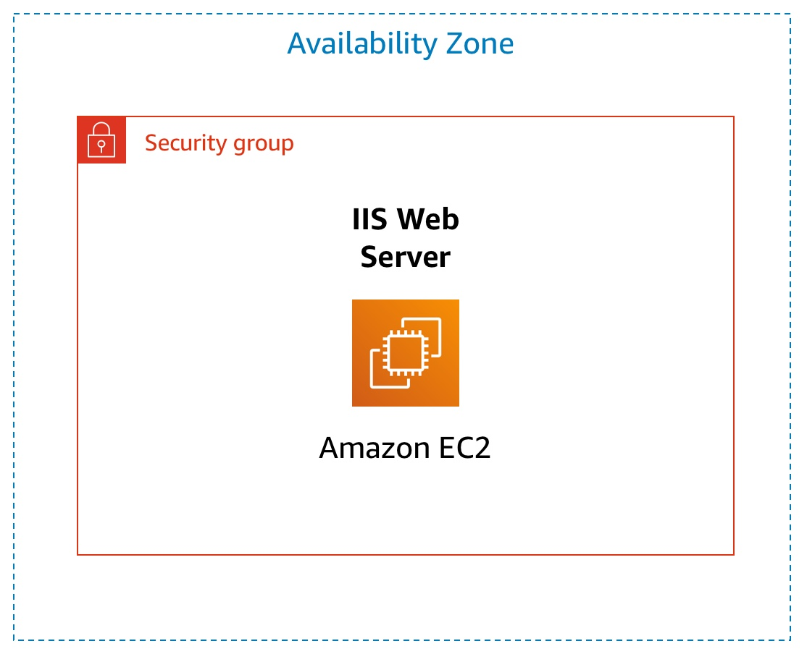

# Introdução ao Amazon EC2

Este laboratório apresenta uma visão geral básica de como executar, redimensionar, gerenciar e monitorar uma instância do Amazon EC2.

O Amazon Elastic Compute Cloud (Amazon EC2) é um serviço da web que fornece capacidade computacional redimensionável na nuvem. Ele foi projetado para facilitar a computação em nuvem na escala da web para os desenvolvedores.

A interface de Web service simples do Amazon EC2 permite que você obtenha e configure capacidade com o mínimo de esforço. Ela oferece um controle completo de seus recursos de computação e permite a execução no ambiente de computação comprovado da Amazon. O Amazon EC2 reduz o tempo necessário para obter e inicializar novas instâncias do servidor em minutos, permitindo o rápido escalonamento da capacidade para mais ou para menos, de acordo com a evolução dos requisitos de computação.

O Amazon EC2 altera a economia da computação, permitindo que você pague somente pela capacidade que realmente utiliza. O Amazon EC2 oferece aos desenvolvedores as ferramentas para criar aplicativos resistentes a falhas e isolá-los de situações de falha comuns.

## Tópicos abordados
Ao final deste laboratório, você será capaz de:

- Executar um servidor web com proteção contra encerramento ativada
- Monitorar sua instância do EC2
- Modificar o grupo de segurança que seu servidor web está usando para permitir acesso HTTP
- Redimensionar sua instância do Amazon EC2 de acordo com a necessidade
- Explorar os limites do EC2
- Testar a proteção contra encerramento
- Encerrar a instância do EC2

